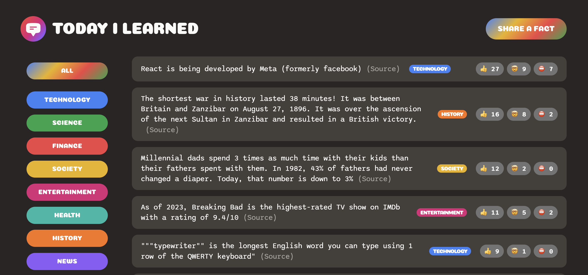

# Today I Learned



Today I Learned is a React project that connects to Supabase, allowing users to explore and contribute to a repository of categorized facts. Whether you're looking to expand your knowledge or share your insights with others, Today I Learned provides a platform to do so efficiently and effectively.

## Features:

- Browse Facts: Explore a wide range of facts organized by categories to find information on topics of interest.
- Contribute: Add new facts to enrich the community knowledge base and share your expertise with others.
- Category Filtering: Tailor your learning experience by filtering facts based on specific categories.

## Technologies Used

- React: A JavaScript library for building user interfaces.
- Supabase: An open-source backends, providing a suite of tools for building scalable applications with Postgres.

## Getting Started

To run this project locally, follow these steps:

1. Install dependencies using npm:

   ```bash
   npm install
   ```

2. Set up Supabase:

   - Sign up for a free Supabase account at [Supabase](https://supabase.io/).
   - Copy `src/supabase.js.exmaple` to `src/supabase.js` and add your own client values.

3. Start the development server.

   ```bash
   npm start
   ```

4. Open your browser and visit `http://localhost:3000` to view the application.
